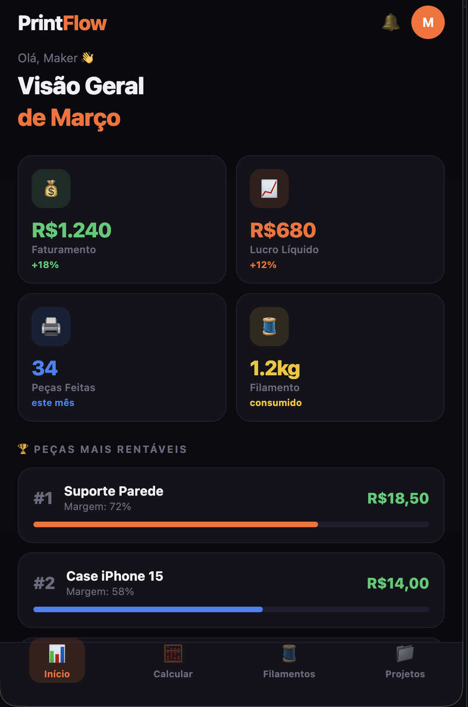
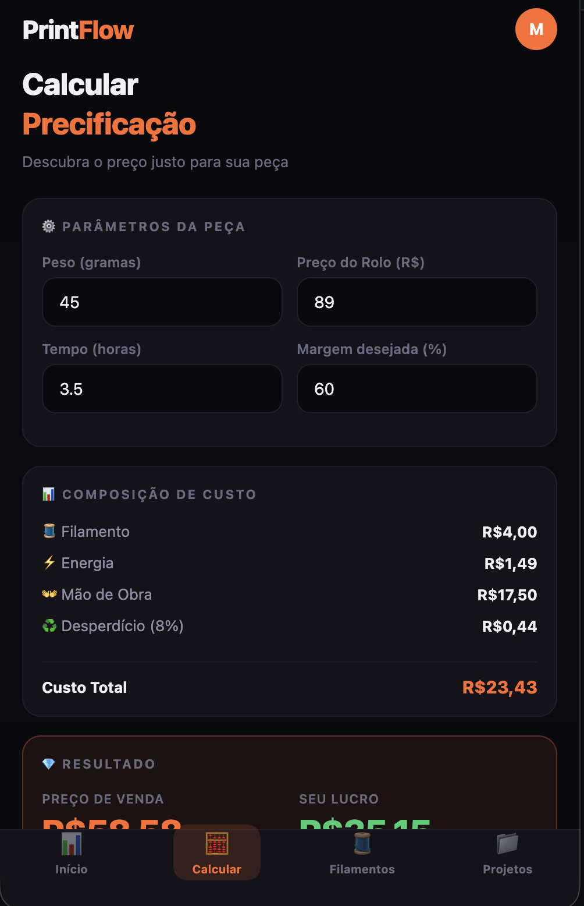
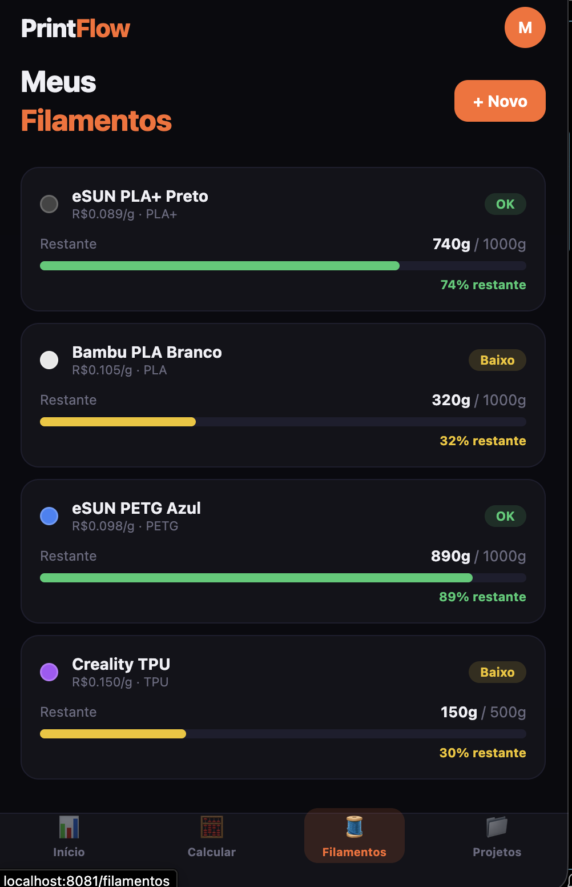
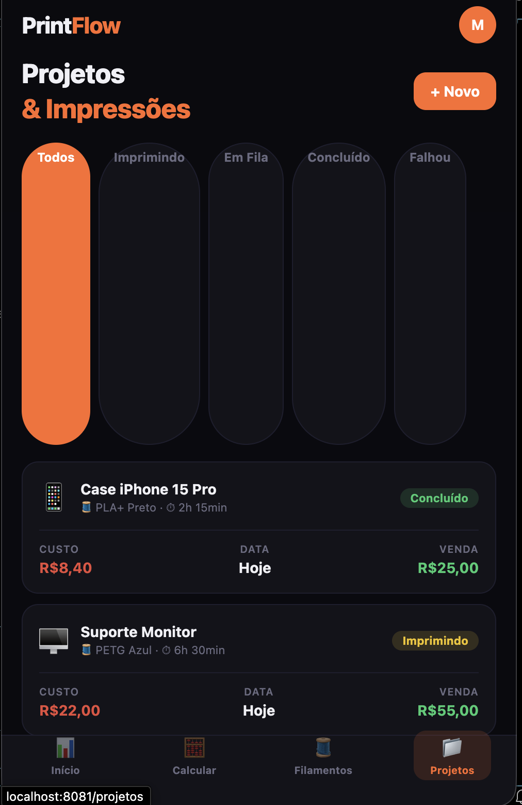
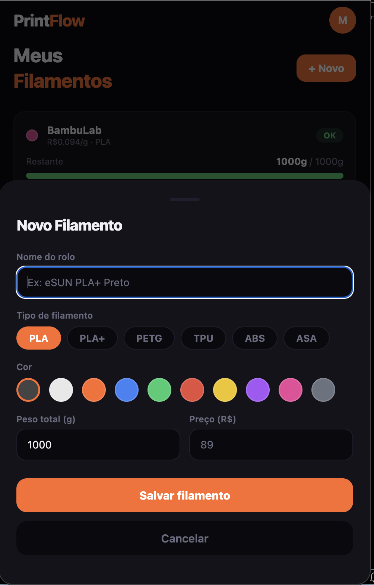

# PrintFlow 🖨️

> App de gestão completa para makers de impressão 3D — controle seus filamentos, projetos e calcule o preço justo para cada peça.

---

## Telas

<div align="center">

| Dashboard | Calculadora |
|:---------:|:-----------:|
|  |  |

| Filamentos | Projetos |
|:----------:|:--------:|
|  |  |

| Modal — Novo Filamento |
|:----------------------:|
|  |

</div>

---

## Sobre o Projeto

O **PrintFlow** nasceu da necessidade real de quem trabalha com impressão 3D e precisa controlar custos, estoque de filamentos e projetos de forma profissional.

A maioria dos makers controla tudo em planilhas ou no "feeling" — o PrintFlow resolve isso com uma interface moderna, rápida e pensada para o celular, com dados persistidos em um backend real.

### Problema que resolve

- Quanto custa realmente imprimir essa peça?
- Quanto de filamento ainda me restou no rolo?
- Qual foi o lucro das minhas impressões esse mês?
- Quais projetos estão na fila, imprimindo ou concluídos?

---

## Funcionalidades

### Dashboard — Visão Geral
A tela inicial mostra os KPIs mais importantes do mês: faturamento, lucro líquido, peças concluídas e horas de impressão — todos calculados em tempo real com dados do banco. Também exibe o ranking das peças mais rentáveis (com barra de margem) e as impressões mais recentes.

### Calculadora de Precificação
Preencha o peso da peça, o preço do rolo, o tempo de impressão e a margem desejada — o app calcula automaticamente todos os custos e o preço de venda ideal em tempo real.

**Fórmula:**
```
Custo Total = Filamento + Energia + Mão de Obra + Desperdício (8%)
Preço de Venda = Custo Total / (1 - Margem%)
Lucro = Preço de Venda - Custo Total
```

### Filamentos — Controle de Estoque
Visualize todos os seus rolos com barra de progresso do quanto resta, custo por grama e status automático (OK / Baixo / Crítico). Adicione novos rolos com tipo, cor e peso pelo botão `+ Novo` — os dados são salvos na API e persistidos no banco.

### Projetos & Impressões
Gerencie todos os seus projetos com filtros por status (Imprimindo, Em Fila, Concluído, Falhou). Cadastre novos projetos escolhendo emoji, tempo de impressão, custo e preço de venda — integrado ao backend via REST API.

---

## Arquitetura

```
┌─────────────────────────┐        HTTP/REST        ┌─────────────────────────┐
│   Frontend (Expo/RN)    │ ──────────────────────► │   Backend (.NET 10)     │
│                         │                          │                         │
│  app/(tabs)/index.tsx   │   GET /api/dashboard     │  DashboardController    │
│  app/(tabs)/filamentos  │   GET/POST /api/         │  FilamentosController   │
│  app/(tabs)/projetos    │        filamentos        │  ProjetosController     │
│  services/api.ts        │   GET/POST /api/projetos │                         │
│                         │                          │  Entity Framework Core  │
└─────────────────────────┘                          │  SQLite                 │
                                                     └─────────────────────────┘
```

---

## Stack Técnica

### Frontend

| Tecnologia | Versão | Uso |
|---|---|---|
| [React Native](https://reactnative.dev/) | 0.83.2 | Framework mobile |
| [Expo](https://expo.dev/) | SDK 55 | Plataforma e tooling |
| [Expo Router](https://expo.github.io/router/) | v5 | Navegação baseada em arquivos |
| [NativeWind](https://www.nativewind.dev/) | v4 | Tailwind CSS para React Native |
| [TypeScript](https://www.typescriptlang.org/) | 5.x | Tipagem estática |

### Backend

| Tecnologia | Versão | Uso |
|---|---|---|
| [ASP.NET Core](https://dotnet.microsoft.com/) | .NET 10 | Web API REST |
| [Entity Framework Core](https://learn.microsoft.com/ef/) | 10.x | ORM e migrations |
| [SQLite](https://www.sqlite.org/) | — | Banco de dados local |

---

## Estrutura do Projeto

```
printflow/
├── app/
│   ├── _layout.tsx              # Layout raiz (SafeAreaProvider + Stack)
│   └── (tabs)/
│       ├── _layout.tsx          # Tab bar com 4 abas
│       ├── index.tsx            # Dashboard (dados da API)
│       ├── calculadora.tsx      # Calculadora de precificação
│       ├── filamentos.tsx       # Estoque de filamentos (API)
│       └── projetos.tsx         # Projetos e impressões (API)
├── services/
│   └── api.ts                   # Cliente HTTP centralizado (fetch + tipos TS)
├── api/                         # Backend ASP.NET Core
│   ├── Controllers/
│   │   ├── DashboardController.cs
│   │   ├── FilamentosController.cs
│   │   └── ProjetosController.cs
│   ├── Models/
│   │   ├── Filamento.cs
│   │   └── Projeto.cs
│   ├── DTOs/
│   │   ├── FilamentoDto.cs
│   │   └── ProjetoDto.cs
│   ├── Data/
│   │   └── AppDbContext.cs      # DbContext (EF Core)
│   ├── Migrations/              # Migrations do banco de dados
│   └── Program.cs               # Configuração da API (CORS, SQLite, auto-migrate)
├── assets/
│   └── screenshots/             # Prints das telas
├── global.css                   # Estilos base do Tailwind/NativeWind
├── tailwind.config.js           # Paleta de cores customizada
├── babel.config.js              # Config do Babel com NativeWind
└── metro.config.js              # Config do Metro bundler
```

---

## Paleta de Cores

O app usa um tema escuro com cores personalizadas:

| Token | Hex | Uso |
|---|---|---|
| `bg` | `#0A0A0F` | Fundo principal |
| `surface` | `#13131A` | Cards e superfícies |
| `separator` | `#1E1E2E` | Bordas e divisores |
| `accent` | `#FF6B2B` | Cor principal (laranja) |
| `success` | `#2ECC71` | Lucros e status OK |
| `danger` | `#E74C3C` | Custos e erros |
| `warning` | `#F1C40F` | Alertas e status baixo |
| `text-main` | `#F0F0F5` | Texto principal |
| `text-muted` | `#6B6B80` | Texto secundário |

---

## Como Rodar Localmente

### Pré-requisitos

- [Node.js](https://nodejs.org/) >= 20
- [.NET SDK](https://dotnet.microsoft.com/download) >= 10
- [Expo CLI](https://docs.expo.dev/get-started/installation/)

### 1. Clone o repositório

```bash
git clone https://github.com/Elwilton/printflow.git
cd printflow
```

### 2. Inicie a API (Terminal 1)

```bash
cd api
dotnet run
# API disponível em http://localhost:5182
```

O banco de dados SQLite (`printflow.db`) é criado e migrado automaticamente na primeira execução.

### 3. Inicie o Frontend (Terminal 2)

```bash
# Na raiz do projeto
npm install
npx expo start --web
```

Acesse `http://localhost:8081` no navegador, ou use o app **Expo Go** no celular escaneando o QR code.

> **Atenção:** Para testar no celular físico, substitua `localhost` pelo IP da sua máquina em `services/api.ts`.

---

## API — Endpoints

| Método | Rota | Descrição |
|---|---|---|
| `GET` | `/api/filamentos` | Lista todos os filamentos |
| `POST` | `/api/filamentos` | Cadastra novo filamento |
| `PUT` | `/api/filamentos/{id}` | Atualiza filamento |
| `DELETE` | `/api/filamentos/{id}` | Remove filamento |
| `GET` | `/api/projetos` | Lista projetos (com filtro `?status=`) |
| `POST` | `/api/projetos` | Cadastra novo projeto |
| `PUT` | `/api/projetos/{id}` | Atualiza projeto |
| `DELETE` | `/api/projetos/{id}` | Remove projeto |
| `GET` | `/api/dashboard` | KPIs agregados do mês |

---

## Roadmap

### Fase 1 — Interface (concluída ✅)
- [x] Dashboard com KPIs
- [x] Calculadora de precificação em tempo real
- [x] Inventário de filamentos com barras de progresso
- [x] Gestão de projetos com filtros por status
- [x] Modais de cadastro para filamentos e projetos

### Fase 2 — Backend (concluída ✅)
- [x] REST API com ASP.NET Core .NET 10
- [x] Banco de dados SQLite com Entity Framework Core
- [x] Migrations automáticas na inicialização
- [x] CRUD completo de Filamentos e Projetos
- [x] Endpoint de Dashboard com KPIs agregados
- [x] Frontend integrado à API via camada `services/api.ts`

### Fase 3 — Autenticação e Nuvem
- [ ] Autenticação de usuário (JWT)
- [ ] Migração para PostgreSQL em produção
- [ ] Deploy da API (Azure / Railway / Render)
- [ ] Sincronização entre dispositivos

### Fase 4 — Funcionalidades avançadas
- [ ] Relatórios mensais e gráficos
- [ ] Alertas de estoque baixo (push notification)
- [ ] Integração com slicers (Bambu Studio, OrcaSlicer)
- [ ] Exportar relatório em PDF

---

## Conceitos Aplicados

### React Native / Expo
- **`View` / `Text`** — equivalentes ao `div` e `span` do web
- **`ScrollView`** — substitui o `overflow-y: auto` do CSS
- **`SafeAreaView`** — evita que o conteúdo fique atrás do notch
- **`TextInput`** — campo de input com `keyboardType="decimal-pad"`
- **`TouchableOpacity`** — botão com efeito de opacidade ao toque
- **`Modal`** — overlay para formulários (bottom sheet pattern)
- **`useState`** — estado local para inputs e listas
- **`useEffect`** — carregamento de dados ao montar a tela
- **NativeWind** — classes Tailwind funcionando no React Native
- **Expo Router** — navegação por sistema de arquivos (como Next.js)

### ASP.NET Core / .NET
- **Controller com Primary Constructor** — injeção de dependência simplificada
- **Entity Framework Core** — ORM com Code First e migrations
- **DTOs com `record`** — objetos imutáveis para entrada de dados
- **CORS** — política de acesso configurada para o frontend
- **`db.Database.Migrate()`** — migrations automáticas na inicialização

---

## Licença

MIT — use à vontade para aprender, modificar e distribuir.

---

Feito com 🧡 por [Elwilton](https://github.com/Elwilton)
